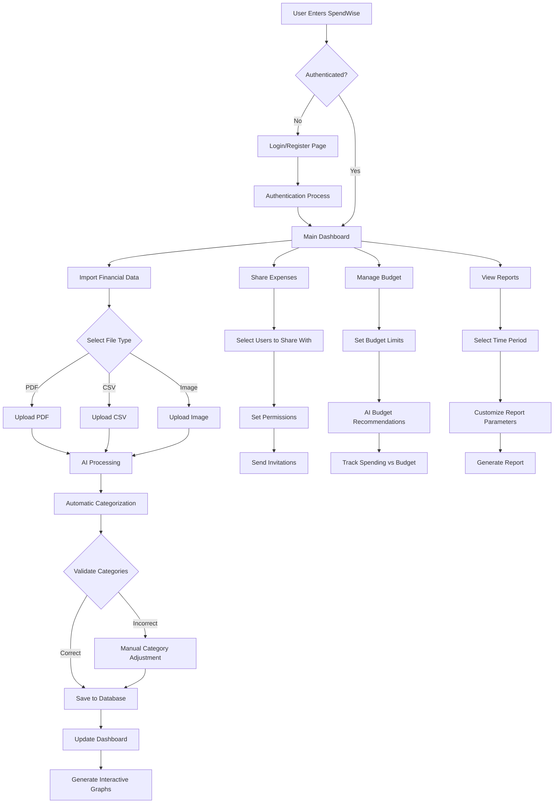

# Tracking Budget

Une application moderne de suivi budgétaire développée avec React, TypeScript et Vite.


## 🚀 Technologies Utilisées

- **Frontend**: React + TypeScript
- **Build Tool**: Vite
- **Styling**: Tailwind CSS + Radix UI
- **Base de données**: Supabase
- **State Management**: React Context/Hooks
- **Testing**: Stories pour les composants
- **Router**: React Router v6

## 📁 Structure du Projet

```
tracking_budget/
├── src/
│   ├── components/        # Composants React réutilisables
│   │   ├── auth/         # Composants d'authentification
│   │   ├── dashboard/    # Composants du tableau de bord
│   │   ├── groups/       # Composants de gestion des groupes
│   │   ├── layout/       # Composants de mise en page
│   │   ├── transactions/ # Composants de gestion des transactions
│   │   └── ui/          # Composants UI réutilisables
│   ├── lib/             # Utilitaires et configurations
│   │   ├── auth.tsx     # Contexte d'authentification
│   │   ├── groups.ts    # Fonctions de gestion des groupes
│   │   └── supabase.ts  # Configuration Supabase
│   ├── pages/           # Pages/Routes de l'application
│   ├── stories/         # Stories pour les composants
│   └── types/           # Définitions TypeScript
├── public/              # Assets statiques
├── supabase/            # Configuration Supabase
│   └── migrations/      # Migrations SQL
└── ...config files      # Fichiers de configuration
```

## 🌟 Fonctionnalités

### Authentification
- Inscription et connexion avec email/mot de passe
- Gestion des profils utilisateurs
- Protection des routes

### Tableau de Bord Personnel
- Vue d'ensemble des finances
- Graphiques des dépenses par catégorie
- Suivi des revenus et dépenses mensuels
- Liste des transactions récentes

### Gestion des Groupes
- Création et gestion de groupes
- Tableau de bord spécifique par groupe
- Suivi des dépenses partagées
- Vue des contributions par membre

### Transactions
- Ajout de transactions (dépenses/revenus)
- Catégorisation des transactions
- Attribution à des groupes
- Partage des dépenses

## 🛠️ Installation

1. Cloner le repository
2. Copier `.env.example` vers `.env` et configurer les variables d'environnement
3. Installer les dépendances :
```bash
npm install
```
4. Appliquer les migrations Supabase :
```bash
supabase db reset
```
5. Lancer le serveur de développement :
```bash
npm run dev
```

## 📦 Scripts Disponibles

- `npm run dev` - Lance le serveur de développement
- `npm run build` - Build l'application pour la production
- `npm run preview` - Preview la version de production
- `npm run lint` - Lance ESLint
- `npm run storybook` - Lance Storybook pour le développement des composants

## 🔒 Variables d'Environnement

Créer un fichier `.env` à la racine du projet avec les variables suivantes :
- `VITE_SUPABASE_URL` - URL de votre projet Supabase
- `VITE_SUPABASE_ANON_KEY` - Clé anonyme Supabase

## 🗄️ Structure de la Base de Données

### Tables Principales
- `profiles` - Informations des utilisateurs
- `transactions` - Transactions financières
- `categories` - Catégories de transactions
- `groups` - Groupes de partage
- `group_members` - Membres des groupes
- `transaction_shares` - Partage des transactions

### Sécurité
- Row Level Security (RLS) activé sur toutes les tables
- Politiques de sécurité pour le partage de données
- Protection des données sensibles

## 🔄 Routes

- `/` - Tableau de bord personnel
- `/auth` - Page d'authentification
- `/groups` - Liste des groupes
- `/groups/:groupId` - Tableau de bord d'un groupe
- `/import` - Import de données

## 🤝 Contribution

Les contributions sont les bienvenues ! N'hésitez pas à ouvrir une issue ou une pull request.
